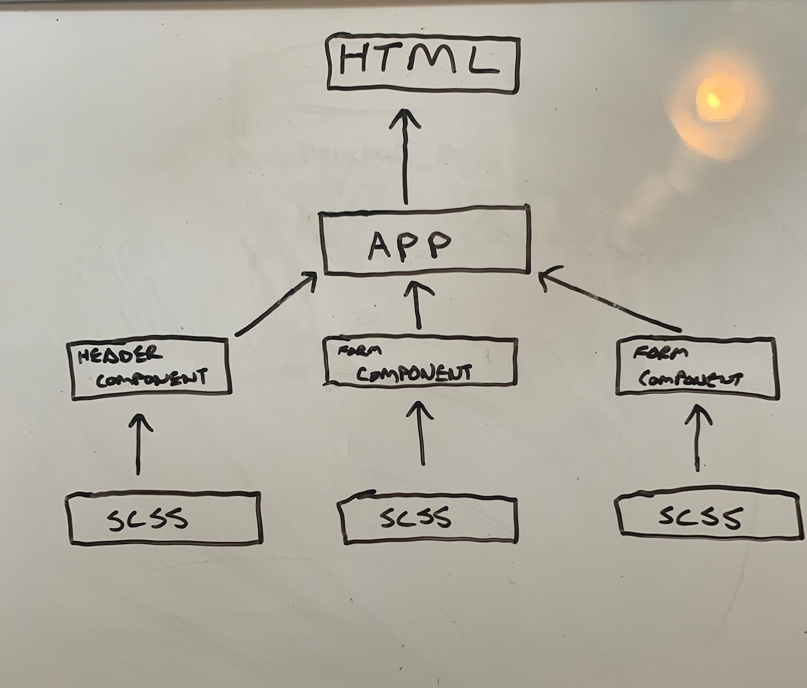

# resty
Resty API Testing Application

### Problem Domain
Our application will be an API testing tool that can be run in any browser, allowing a user to easily interact with APIs in a familiar interface.

### UML Diagram

### User Stories
* As a user, I expect an easy to read and understand user interface so that I can use the application intuitively
* As a user, I want to enter the URL to a REST API and select the REST method to use to access it
* As a user, I want visual confirmation that my entries and selections are valid so that I have confidence the application will be able to fetch the API data that I’ve requested
* Create a visually appealing site with a Header, Footer, and a large content area
* Create a form that asks for a URL
* Create buttons that let the user choose from the REST methods (get, post, put, delete)
When the form is filled out, and the button is clicked, display the URL and the method chosen

### Technical Requirements

* React
* ES6 Classes
* Shared Component State
* Local Storage for storing request history
* Superagent or Axios for performing API requests
* SASS for styling
  * Global Theme
  * Component specific CSS where possible
* Test Driven Development with Jest
* Deployment to GitHub Pages using an Action

### Application SetUp
* Run `npm create-react-app (app name)`

### Starting the Application
* Run 'npm start' for inside root folder
* Run 'Live-Server' on Index.HTML to view application front-end

### Dependencies
* "@testing-library/jest-dom": "^4.2.4",
* "@testing-library/react": "^9.5.0",
* "@testing-library/user-event": "^7.2.1",
* "babel-jest": "^24.9.0",
* "react": "^16.13.1",
* "react-dom": "^16.13.1",
* "react-scripts": "3.4.3"
